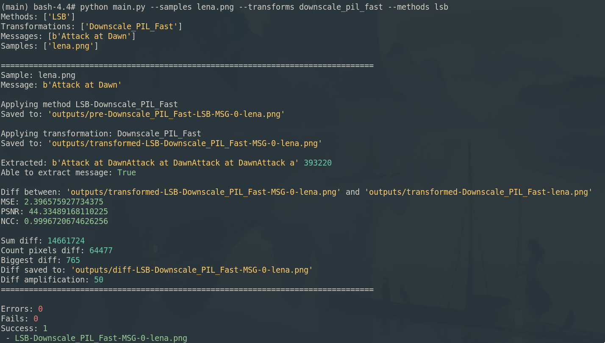

# Preserving Steganography Information Over Image Transformations
The following repository contains code related to my master thesis at NTNU. The repository aims to be easy to expand either by adding more steganography methods or image transformations. Most of the code runs in Python, but some other external dependencies are also needed, such as ImageMagick, Steghide, etc. 

This project was developed with Pipenv and Nix to be easy to pick up and deterministic to build and reproduce.


## Getting started
There are a few ways to get started. 

### Nix-shell and dotenv (Recommended)
The easiest would be to have the Nix package manager installed along with dotenv. You do not have to be running NixOS to use the Nix package manager and it can be used alongside existing package managers for Nix projects such as this.

You can read more about nix-shell and dotenv [here](https://nixos.wiki/wiki/Development_environment_with_nix-shell).

If you have them both running and activated, you can simply activate the dotenv config by running the following command in the root directory of the project:
```bash
direnv allow
pipenv sync
```
That should be enough to active the full environment with all dependencies installed. You can then interact with the project using the `python main.py --help` command.

### Nix-shell
If you have just Nix installed you can activate the project manually by entering:
```bash
nix-shell shell.nix
pipenv sync
```
That should be enough to active the full environment with all dependencies installed. You can then interact with the project using the `python main.py --help` command.

### Docker
Alternatively, you can also check out the project in an interactive docker container:
```bash
docker run --rm -it -v "${pwd}:/main" nixos/nix
bash-4.4$ cd /main/
bash-4.4$ nix-shell shell.nix
bash-4.4$ pipenv sync
bash-4.4$ pipenv shell
bash-4.4$ python main.py --help
```

## Usage:
The only executable is the `python main.py` command, which takes args for specifying which transformations, samples and methods to use. By default it will run all. The test results are written to the `./output/` folder which is cleared at each run. Samples are available in the `./samples/` folder and you can easily add your own. The methods and transformations are listed in the `./methods/` and `./transformations/` folders. Here you can create new files and list them in the folders `__init__.py` files to make them load.

To list all available samples, methods, transformations and messages that will be tested, simply run `--list`. You can then add flags like `--samples png` which will run only the samples which contains the string `png` (ignore case). You can also list multiple matches like `frymire,lena` which will match:
* `lena.jpg`
* `lena.png`
* `frymire.jpg`
* `frymire.png`

For more options and control, use the `--help` flag.

## Results:
Each time you run the project, it will output files to the `./outputs/` folder. Currently the project has been run to create all tests, so that the output results of all image files can be browsed without having to run the project. Running the project yourself allows you more granular control of the output and also stats such as MSE, PSNR and NCC. 

Generating all the results might take a little while. On a Intel 6 core i7-8700 and a Toshiba XG5 NVMe SSD it takes about 20 to 25 minutes to run the full test set.

